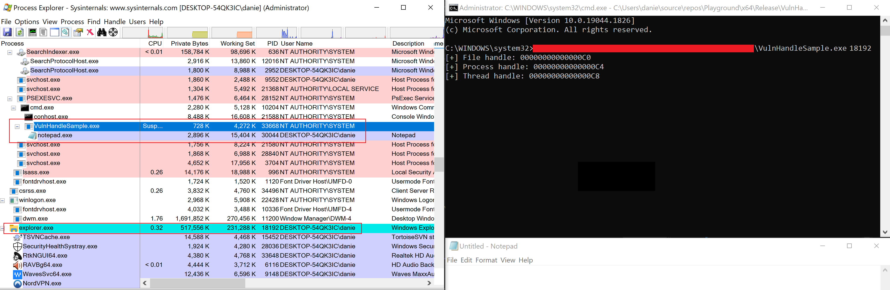

## What is this?
A **vulnerable by the design** application that leaks privileged handles to a non-privileged child process.

## How to use it?
Execute the application as a system or a high-integrity process providing it with the PID of a low-privileged user process.

